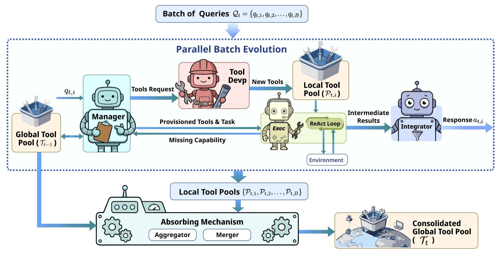

<div align="center">

</div>


<div align="center">

[](https://www.yunjuetech.com/en)
[](https://www.yunjuetech.com/Yunjue-Agent/)
[](https://github.com/YunjueTech/Yunjue-Agent)
[](tech_report/YunjueAgentTechReport.pdf)
[](https://huggingface.co/datasets/YunjueTech/Yunjue-Agent-Traces)

</div>

</div>

<div align="center">

### [English](README.md)｜[中文](README_zh.md)

</div>

<div align="center">

</div>

---

本仓库是 **Yunjue Agent**（云玦智能体）的官方实现。云玦科技（Yunjue Technology）是一家致力于构建**自进化 AGI（通用人工智能）和穿戴式设备的前沿科技公司。我们是一群不知疲倦的探索者，成员汇聚自顶尖 AI 实验室和工程团队。我们不满足于“静态”的大模型——即那些在训练完成瞬间参数矩阵就被冻结的模型。我们坚信，真正的智能不在于存储了多少过去的知识，而在于面对未知的未来时，具备适应、学习和创造工具**的能力。

我们欢迎各方交流。无论是融资咨询、技术探讨，还是希望加入我们的团队，请通过 qiweizhen@yunjuetech.com 联系我们。

## 📰 新闻与动态

* **[2026-01-26]** 🎉 **首次发布**：我们开源了 **Yunjue Agent** 框架！
* **[2026-01-31]** 📦 **数据发布**：我们发布了在 **5 个数据集**（**HLE**, **DeepSearchQA**, **FinSearchComp (T2&T3)**, **xbench-ScienceQA** 和 **xbench-DeepSearch**）**zero-start settings** 下的系统日志：[Google Drive](https://drive.google.com/drive/folders/1mL5PqKZwOUVIP-UYg0bZr11fotpZmcqb?usp=sharing)。新增访问方式：[Huggingface Dataset](https://huggingface.co/datasets/YunjueTech/Yunjue-Agent-Traces)支持一键导入执行轨迹分析。
* **[2026-01-31]** ✨ **复现与评测更新**：我们整理了评测脚本与复现流程（见下方 [复现结果](#-复现结果) 小节）。
* **[2026-02-08]** 📄 **技术报告更新**: 我们更新了技术报告，增加更多系统性能、成本以及 Evolutionary generality loss (EGL) 的理论与实验分析。您可以从 [arXiv](https://arxiv.org/abs/2601.18226) 或 [本地 PDF](tech_report/YunjueAgentTechReport.pdf) 获取。
* **[2026-02-11]** 🔀 **复现分支更新**：我们已将复现流程迁移到独立稳定分支：[reproduce](https://github.com/YunjueTech/Yunjue-Agent/tree/reproduce)。
* **[2026-02-11]** 🎬 **Demo 发布**：我们新增了两个 Demo（Web Demo 和 CLI Skill Demo），见下方 [Demo 快速开始](#-demo-快速开始) 小节。

---

## 🚀 快速开始 (Quick Start)

### 📋 环境要求

* **Python**: 3.12 或更高版本
* **包管理器**: [`uv`](https://docs.astral.sh/uv/)
* **操作系统**: MacOS

### ⚡ 快速安装

```bash
# 1. 克隆并设置
git clone https://github.com/YunjueTech/Yunjue-Agent.git && cd Yunjue-Agent

chmod +x install.sh

./install.sh

# NOTE: `install.sh` installs the `codex` CLI, but you still need to configure Codex yourself
# (e.g., set `OPENAI_API_KEY` and optionally `CODEX_PROFILE` in your environment).
cp .env.example .env

cp conf.yaml.example conf.yaml

source .venv/bin/activate
```

### ⚙️ 配置说明

- **配置字段解释**：请阅读 `docs/configuration_reference.md`（包含 `.env` 的关键字段，如 `TAVILY_API_KEY`、`MAX_WORKER_RECURSION_LIMIT`、`MAX_TASK_EXECUTION_CNT`、`PROXY_URL`，以及 `conf.yaml` 的字段，如 `VISION_MODEL`、`SUMMARIZE_MODEL`）。
- **配置模板**：从 `.env.example` 与 `conf.yaml.example` 开始修改。

### 🧪 复现结果

- 我们已将复现迁移到稳定分支以保证可复现性：[reproduce](https://github.com/YunjueTech/Yunjue-Agent/tree/reproduce)
- 详细复现指南请参考该分支。
- **系统轨迹**：我们在 [Hugging Face](https://huggingface.co/datasets/YunjueTech/Yunjue-Agent-Traces) 上提供了完整的系统轨迹供分析。

### 🎬 Demo 快速开始

> 注：目前仅在 MacOS 上测试过。如遇到问题，欢迎提 Issue 和 PR。

#### Web Demo

我们提供了一个可由开发者自行部署的 Web Demo，用于展示 Yunjue Agent 的工具自进化能力与执行过程。第一个 Demo 展示 Agent 如何进行工具分解，并创建工具来从互联网搜索与抓取 PDF；第二个 Demo 展示了通过复用已有工具来搜索美股信息的能力。

```bash
source .venv/bin/activate
uvicorn web_demo.app:app --app-dir . --port 8000
```

- UI: `http://127.0.0.1:8000/`
- 健康检查: `http://127.0.0.1:8000/health`
- 详细指南: `docs/web_demo.md`

#### CLI Skill Demo

Yunjue Agent 简化了从经验到执行的路径。你只需提供一份 `SKILL.md`（我们认为高层经验仍然是由人驱动的重要资产），Agent 就会自主生成执行这些技能所需的工具。让文档化知识无缝转化为可执行自动化。

```bash
source .venv/bin/activate
python -m cli.cli
```

- 示例技能目录: `example/cli/skills`
- 详细指南: `docs/cli.md`

---

## 🤖 什么是 Yunjue Agent?

传统的 Agent 系统通常在开放环境中表现挣扎，因为任务分布不断变化且缺乏外部监督。它们依赖静态工具集或离线训练，滞后于环境动态，导致系统的能力边界僵化且未知。为了解决这个问题，我们提出了 **原位自进化（In-Situ Self-Evolving）** 范式。

这种方法将连续的任务交互视为持续的经验流，使系统能够在没有真实标签的情况下，将短期执行反馈提炼为长期的、可复用的能力。在此框架内，我们将 **工具进化** 视为能力扩展的关键路径，因为它提供了可验证的二元反馈信号。基于此框架，我们开发了 **Yunjue Agent**，这是一个能够迭代合成、优化和复用工具以应对新挑战的系统。

为了优化进化效率，我们进一步引入了 **并行批量进化** 策略。在零起点设置下对五个不同基准进行的实证评估表明，该系统显著优于专有基线模型。此外，补充的热启动评估证实，积累的通用知识可以无缝迁移到新领域。最后，我们提出了一种监控进化收敛的新指标，其功能类似于传统优化中的训练损失。我们开源了代码库、系统轨迹和进化后的工具，以促进对弹性、自进化智能的未来研究。



---

## 🌟 核心亮点

* **🧬 原位自进化范式**
我们引入了一种新颖的 Agent 学习框架，弥合了静态能力与即时进化之间的鸿沟。通过将离散交互重构为连续的经验流，系统通过内部反馈循环将短期推理提炼为长期能力。这使得 Agent 无需额外的监督信号，即可在开放环境中实现实时适应和探索。
* **🚀 "白板"起步即达 SOTA**
从**空工具库**开始，我们的系统仅依靠推理时的生成、验证和归纳，就达到了最先进的性能。它表现出了相对于后端模型的显著提升（例如，在 DeepSearchQA 上比 Gemini 3 Pro 提升了 **+17.4%**），并在 **HLE 排行榜上获得第 2 名**，证明了从零开始自举通用能力的可行性。
* **🛠️ "工具优先"的进化原则**
我们将工具进化置于记忆或工作流之上，作为能力的主要驱动力。工具提供客观的 **二元反馈**，在缺乏人类标注的情况下充当可靠的内部监督信号。这种方法降低了幻觉风险并防止了策略偏差，确保了通用原语的稳定积累。
* **🔍 完全可复现与开放轨迹**
我们发布了一套全面的开放资产，包括端到端代码、基准测试脚本、版本化的工具制品和完整的交互轨迹。这将“黑盒”Agent 结果转化为透明、可审计的研究，使研究人员能够对工具收敛性、进化效率和合并策略进行细粒度分析。

## 📈 基准测试表现

我们在 **HLE**、**DeepSearchQA**、**FinSearchComp (T2&T3)**、**xbench-ScienceQA** 和 **xbench-DeepSearch** 等一系列基准测试中对 Yunjue Agent 进行了评测，并取得了 SOTA 结果。


---

## Star 趋势

[](https://www.star-history.com/)

---

## 📄 许可证

本项目采用 Apache License 2.0 许可证。

---
